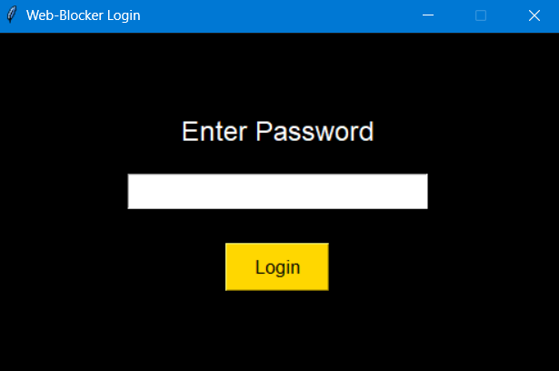
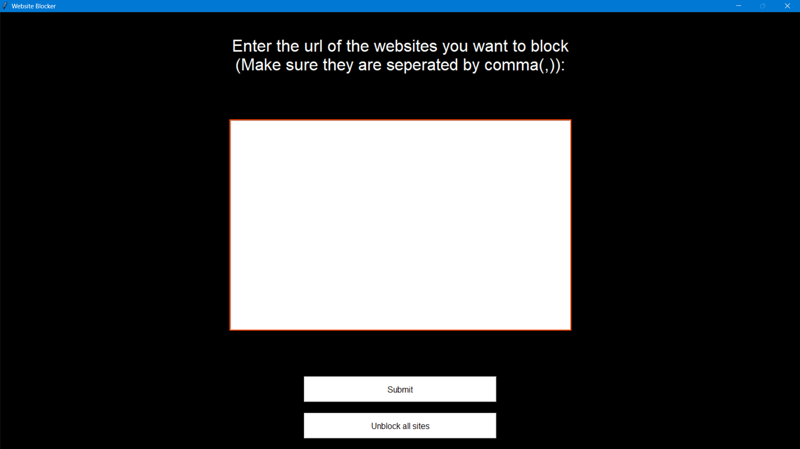

# Website Blocker

This is a simple Python-based website blocker application that allows users to block specific websites by modifying the `hosts` file on their computer. The application uses a graphical user interface (GUI) built with Tkinter, making it easy to block and unblock websites. The user can input a list of websites they want to block, separated by commas.

## Features

- **Block Websites**: Enter the URL of websites to block (separate multiple websites with commas).
- **Unblock Websites**: Unblock all previously blocked websites by clearing the `hosts` file.
- **Password Protection**: Login functionality to ensure only authorized users can access the main functionality of the app.

## Requirements

To run this project, you'll need to have the following Python libraries installed:

- `tkinter` (usually comes with Python)
- `messagebox` (part of `tkinter`)

No external dependencies are required for this project.

## Setup

1. **Clone the repository**:

   ```bash
   git clone https://github.com/your-username/website-blocker.git
   cd website-blocker
   ```

2. **Install Tkinter** (if not already installed):

   - For Windows, Tkinter comes pre-installed with Python. If it is not installed, you can install it by downloading the appropriate Python version from [python.org](https://www.python.org/downloads/).

3. **Run the Application**:

   To start the website blocker app, run the following command:

   ```bash
   python main.py
   ```

   This will open a login screen where you can enter the password to access the website blocking functionality.

## How It Works

1. **Login Screen**: The application starts with a login screen where the user must enter a password. The default password is `grantAccess`. If the user enters the correct password, they are granted access to the main screen of the app.
   
2. **Main Screen**:
    - The main screen prompts the user to enter a list of website URLs they want to block (separated by commas).
    - The application then updates the `hosts` file (usually located at `C:\Windows\System32\drivers\etc\hosts` on Windows) by adding `127.0.0.1` followed by the website addresses to block.
    - If the websites are already blocked, the app notifies the user.
    - The user can also unblock all websites by clicking the "Unblock all sites" button, which clears the `hosts` file.
   
3. **Security**: The app checks if the user is authorized to access the blocking functionality by requiring the correct password.

## Important Notes

- **Administrator Access**: Modifying the `hosts` file requires administrative privileges. Ensure you run the Python script with administrator rights, or you may encounter permission issues when attempting to block websites.
  
- **Operating System**: This script is currently designed to work on Windows systems, as it accesses the `hosts` file located in the `C:\Windows\System32\drivers\etc\hosts` directory. If you're on a different operating system, you may need to modify the script to match the location of your `hosts` file.

## Screenshots

- **Login Screen**:

  

- **Main Screen**:

  

---

## Contact

Author: [Mohammed Abdullah Amaan](mailto:abdullah@abdullahamaan.com)